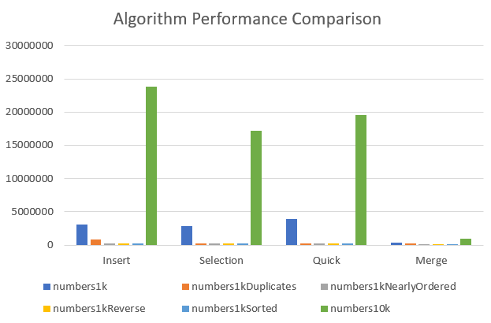

# Sorting Algorithms
Algorithms! Writing several algorithms, analysing their efficacy and running tests to ensure they work as expected with various types of inputs.
This repo uses Java JUnit testing to run various data sets through each algorithm. 

## Algorithms Covered
* Insertion Sort
* Selection Sort
* Quick Sort
* Merge Sort

## Algorithm Performance Comparison
An algorithm performance comparison performed (results in graph) shows the efficacy of each sorting algorithm. This experiement only takes in to account the cost of time, not space. Each data set was run three times for each algorithm and the average was taken and the time is measured in nano seconds. The data sets used can be found in /files
### Outcomes
The outcome for Insertion, Selection and Quick sort were similar across all data sets. Insertion sort mildly suffered efficacy when faced with duplicates in the data set. The overall winner is Merge Sort which maintained consistently the lowest by far for all data sets provided. 

Insertion, Selection and Quick sort did not scale as well with the larger data set (10k doubles) compared to Merge Sort. This demonstrates the Divide and Conquer advantages, however the let down with Quick Sort (as it is also Divide and Conquer) potentially owing to its method of array partitioning.
